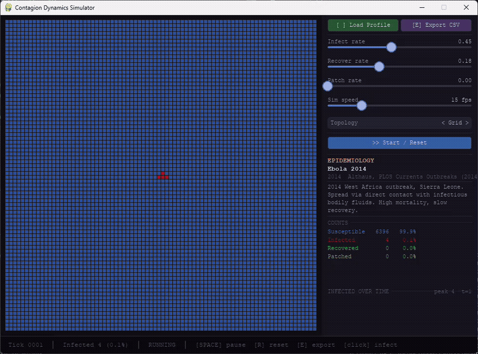

# Contagion Dynamics Simulator

A cellular automata simulation engine for modeling how things spread through
networks, whether that's malware across enterprise infrastructure or a
hemorrhagic fever through a contact population.

Built in Python, runs in real time, and fully configurable via JSON profiles.



---

## The idea

Epidemiologists and cybersecurity researchers are solving the same underlying
problem: given a network of connected nodes, a transmission rate, and a
recovery rate, how does a contagion behave? The math is the same and this
tool is built to visually present it.

Each node on the grid is a host: a computer, a person, a device. The rules
are simple, a susceptible node adjacent to an infected node has some sort of
probability of catching it each tick. An infected node has some probability
of recovering. Everything else, the wave front, the die-off, the effect of
patching, the catastrophic difference between grid and hub-and-spoke topology,
emerges from those two numbers.

---

## Node states

| Color  | State       | Cybersecurity            | Epidemiology       |
|--------|-------------|--------------------------|--------------------|
| Blue   | Susceptible | Unpatched system         | Uninfected host    |
| Red    | Infected    | Compromised node         | Active case        |
| Green  | Recovered   | Reimaged / cleaned       | Immune             |
| Yellow | Patched     | Firewall / EDR protected | Vaccinated         |

---

## Controls

| Input          | Action                                      |
|----------------|---------------------------------------------|
| `SPACE`        | Pause / unpause                             |
| `R`            | Reset simulation (reloads active profile)   |
| `E`            | Export full SIRP data as CSV                |
| `CLICK`        | Drop patient zero at cursor position        |
| Load Profile   | Open any JSON profile from `profiles/`      |
| Start / Reset  | Restart with current slider values          |

---

## Profiles

Profiles are JSON files that define a threat or disease. Drop any `.json`
file into the `profiles/` folder and load it at runtime.

```json
{
  "name": "WannaCry",
  "domain": "cybersecurity",
  "year": 2017,
  "infect_rate": 0.70,
  "recover_rate": 0.00,
  "patch_rate": 0.08,
  "reinfection": false,
  "topology": "Hub-and-spoke",
  "color": [255, 60, 120],
  "description": "2017 ransomware exploiting EternalBlue SMB vulnerability. Spread via enterprise intranets. Systems do not self-recover — only patching removes vulnerability.",
  "source": "Chernikova et al., Applied Network Science (2022); Microsoft MSRC"
}
```

Parameters are derived from published epidemiological and threat research sources.
See each profile's `source` field and the citations section below.

### Included profiles

**Cybersecurity**
- `wannacry.json` — 2017 EternalBlue ransomware worm
- `sql_slammer.json` — 2003 UDP worm, fastest-spreading malware on record

**Epidemiology**
- `ebola_2014.json` — 2014 West Africa outbreak, Sierra Leone parameters
- `spanish_flu_1918.json` — 1918 H1N1 pandemic, San Francisco wave
- `measles.json` — Hagelloch 1861 outbreak, clustered network parameters
- `covid19_wuhan.json` — Original SARS-CoV-2 strain, pre-variant Wuhan

---

## What the topology toggle demonstrates

This is the most important thing to play with. Load WannaCry, set topology
to Grid, and watch it spread. Then reset and switch to Hub-and-spoke with
the same parameters. The infection is catastrophically faster, because
hub nodes (domain controllers, file servers, routers) act as super-spreaders
that bypass the slow wave-front propagation of a uniform lattice.

This is why network segmentation is a core defense strategy. Eliminating
hubs, or isolating them, changes the fundamental topology of what they can reach.

---

## CSV export

Press `E` at any point to export a full tick-by-tick snapshot of the simulation.
The output includes all four compartments (S, I, R, P) per tick plus a metadata
header documenting the profile name, source, and exact parameter values used.

```
# Profile: Ebola 2014
# Domain:  epidemiology
# Source:  Althaus, PLOS Currents Outbreaks (2014)
# infect_rate=0.45  recover_rate=0.18  patch_rate=0.0  topology=Grid

tick,susceptible,infected,recovered,patched,total
1,6399,1,0,0,6400
2,6395,4,1,0,6400
...
```

---

## Adding your own profile

Create a `.json` file in `profiles/` with these fields:

```json
{
  "name": "Your threat name",
  "domain": "cybersecurity or epidemiology",
  "year": 2024,
  "infect_rate": 0.0,
  "recover_rate": 0.0,
  "patch_rate": 0.0,
  "reinfection": false,
  "topology": "Grid, Random, or Hub-and-spoke",
  "color": [R, G, B],
  "description": "One or two sentence description.",
  "source": "Author, Publication (Year)"
}
```

**Parameter guidance:**
- `infect_rate` — probability per tick that a susceptible neighbor catches it (0.0–1.0)
- `recover_rate` — probability per tick that an infected node clears (0.0–1.0)
- `patch_rate` — probability per tick that a susceptible node self-patches (0.0–0.2)
- `reinfection` — whether recovered nodes can be reinfected; `true` for memory-resident malware like SQL Slammer, `false` for most others

---

## Installation

```bash
git clone https://github.com/yourusername/contagion-sim
cd contagion-sim
python -m venv venv
venv\Scripts\activate        # Windows
source venv/bin/activate     # macOS / Linux
pip install -r requirements.txt
python main.py
```

**Requirements:** Python 3.10+, pygame, numpy

---

## Tech stack

- **Python 3.10+**
- **NumPy** — grid state management and vectorized neighbor computation
- **Pygame** — real-time cellular automata rendering
- **tkinter** — native OS file picker for profile loading (stdlib, no install needed)

---

## Sources and parameter citations

All simulation parameters are derived from peer-reviewed literature or primary
incident data. Parameters are per-tick probabilities scaled to produce
behaviorally equivalent dynamics to the cited real-world values.

| Profile | Parameter source |
|---------|-----------------|
| Ebola 2014 (Sierra Leone) | Althaus, C.L. (2014). *Estimating the Reproduction Number of Ebola Virus During the 2014 Outbreak in West Africa.* PLOS Currents Outbreaks. |
| 1918 Spanish Flu | Chowell, G. et al. (2007). *Comparative estimation of the reproduction number for pandemic influenza.* Journal of the Royal Society Interface. |
| Measles (Hagelloch) | Gallagher, S.K. et al. *EpiCompare: Vignettes for fitting the SIR model to Hagelloch data.* Neal, P. et al. (2004). *A network-based analysis of the 1861 Hagelloch measles data.* Biostatistics. |
| COVID-19 (Wuhan) | Roda, W.C. et al. (2020). *Why is it difficult to accurately predict the COVID-19 epidemic?* Infectious Disease Modelling. |
| WannaCry | Chernikova, A. et al. (2022). *Modeling self-propagating malware with epidemiological models.* Applied Network Science. Microsoft Security Response Center, MS17-010. |
| SQL Slammer | Moore, D. et al. (2003). *Inside the Slammer Worm.* IEEE Security & Privacy. CAIDA/UCSD Network Telescope data. |

---

## Roadmap

- [ ] Multi-strain competition (two profiles running simultaneously on the same grid)
- [ ] Network graph export (GraphML) for post-hoc analysis
- [ ] Side-by-side comparison mode

---

## Background

This project started as a malware propagation visualizer and expanded when I
realized the SIR epidemiological model is mathematically identical to how
network worms spread. The same engine, the same parameters, the same emergent
behavior — the only thing that changes is the JSON file you load.

The goal is to make contagion dynamics *visible* in a way that differential
equations on a whiteboard don't. Load a historical profile and immediately see
why WannaCry consumed hub-and-spoke enterprise networks in hours, or why
Ebola's low R0 made it containable through contact tracing despite its high
fatality rate.

---

## Author

Abdullah — B.S. Information Assurance and Cyber Defense, Eastern Michigan
University (Summa Cum Laude, 2026). Built as a portfolio project exploring
the intersection of network security and computational epidemiology.